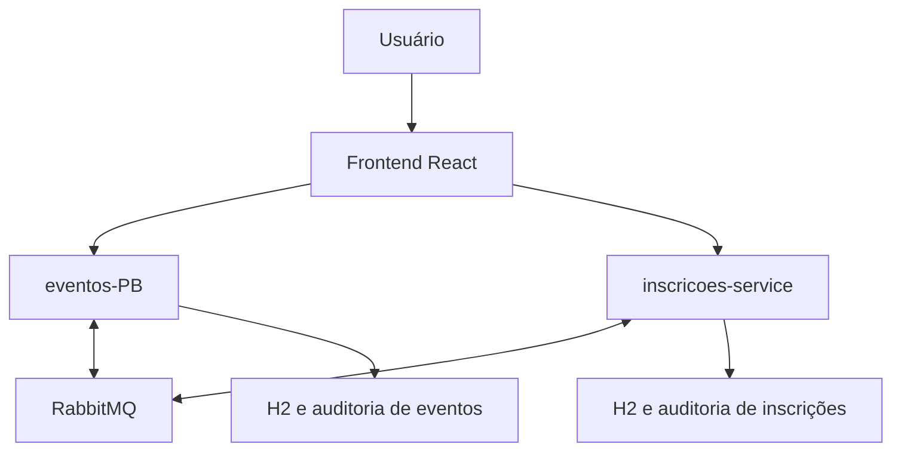
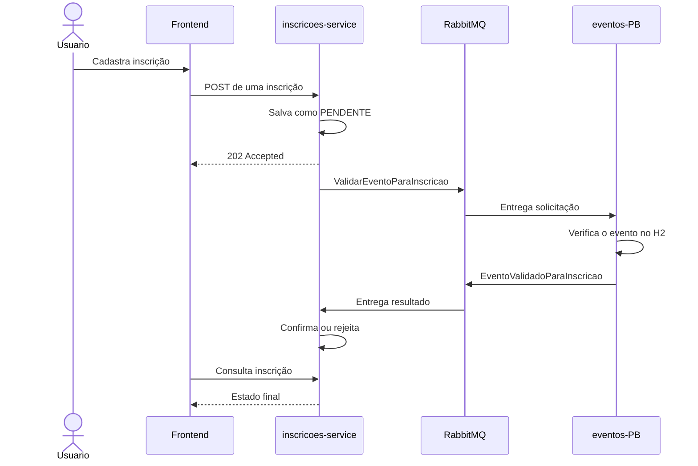
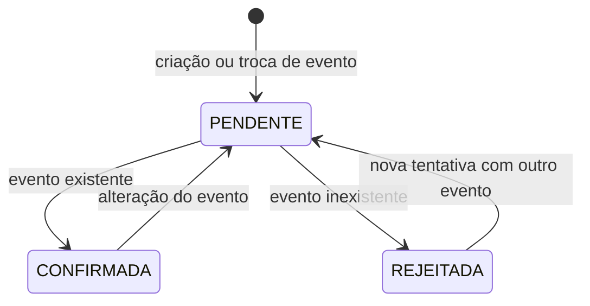
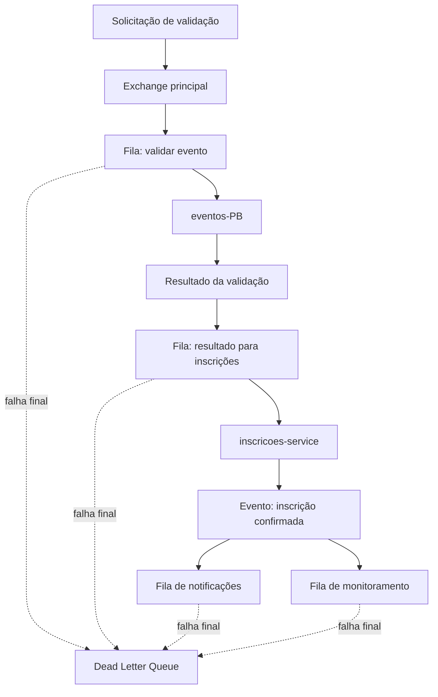

# Eventos Express — Arquitetura Orientada a Eventos

## 1. Visão geral

O Eventos Express é composto por dois backends e uma aplicação frontend:

- **eventos-PB:** responsável pelo cadastro, consulta, alteração e exclusão de eventos;
- **inscricoes-service:** responsável pelo cadastro e acompanhamento das inscrições;
- **eventos-front:** interface React utilizada para operar o sistema;
- **RabbitMQ:** message broker responsável pela comunicação assíncrona entre os backends;
- **H2:** banco utilizado individualmente por cada backend;
- **arquivos JSONL:** armazenam o histórico de alterações para auditoria.

Antes da refatoração, o `inscricoes-service` consultava o serviço de eventos de forma síncrona usando OpenFeign. Dessa maneira, uma inscrição dependia da disponibilidade e da resposta imediata do `eventos-PB`.

Depois da refatoração, essa integração passou a ser assíncrona. O serviço de inscrições grava a solicitação como `PENDENTE`, publica uma mensagem no RabbitMQ e devolve HTTP `202 Accepted`. O serviço de eventos valida o evento e publica uma resposta. Por fim, o serviço de inscrições atualiza o estado para `CONFIRMADA` ou `REJEITADA`.

## 2. Arquitetura geral

O frontend continua utilizando HTTP para interagir com as APIs. A alteração arquitetural foi feita na comunicação interna entre os backends, que deixou de utilizar uma chamada HTTP direta e passou a utilizar mensagens.

Cada serviço mantém sua própria responsabilidade e seus próprios dados. O RabbitMQ não substitui o banco: ele transporta as mensagens necessárias para coordenar o processamento entre os serviços.

## 3. Comparação entre a arquitetura anterior e a atual

| Característica | Antes da refatoração | Depois da refatoração |
| --- | --- | --- |
| Comunicação interna | HTTP com OpenFeign | Mensagens pelo RabbitMQ |
| Resultado da criação | Imediato | Eventualmente consistente |
| Resposta do POST | `201 Created` | `202 Accepted` |
| Estado inicial | Inscrição já concluída | `PENDENTE` |
| Dependência entre serviços | Direta e temporal | Indireta pelo broker |
| Serviço de eventos indisponível | A operação falhava imediatamente | A mensagem pode aguardar na fila |
| Escalabilidade dos consumidores | Limitada pela chamada direta | Consumidores podem ser replicados |
| Tratamento de falhas | Exceção HTTP | Retry, confirmação e DLQ |

## 4. Fluxo principal de criação de inscrição

### Passos do processamento

1. O frontend envia os dados da inscrição para o `inscricoes-service`.
2. O serviço valida os dados obrigatórios e gera um `solicitacaoId`.
3. A inscrição é persistida com estado `PENDENTE`.
4. A API devolve HTTP `202 Accepted`, pois o processamento ainda não terminou.
5. Depois do commit da transação, uma mensagem `ValidarEventoParaInscricao` é publicada.
6. O `eventos-PB` consome a mensagem e consulta seu próprio banco.
7. O resultado é publicado como `EventoValidadoParaInscricao`.
8. O `inscricoes-service` compara os identificadores da resposta com os da operação atual.
9. Se o evento existir, a inscrição muda para `CONFIRMADA`.
10. Se o evento não existir, muda para `REJEITADA` e recebe o motivo da rejeição.
11. Quando confirmada, a aplicação publica `InscricaoConfirmada`, permitindo que outros componentes reajam ao acontecimento.

## 5. Estados da inscrição

- **PENDENTE:** a inscrição foi aceita, mas a validação assíncrona ainda não terminou;
- **CONFIRMADA:** o serviço de eventos confirmou que o evento existe;
- **REJEITADA:** o evento não existe ou a validação produziu uma resposta negativa.

O frontend apresenta esses estados ao usuário e permite atualizar a consulta para acompanhar o resultado.

## 6. Contratos das mensagens

Os contratos foram criados nos dois backends para que produtores e consumidores utilizem a mesma estrutura lógica.

### ValidarEventoParaInscricao

Solicita ao serviço de eventos a validação do evento informado na inscrição.

| Campo | Finalidade |
| --- | --- |
| `mensagemId` | Identifica unicamente a mensagem |
| `versaoMensagem` | Controla a versão do contrato |
| `ocorridoEm` | Informa quando a mensagem foi criada |
| `solicitacaoId` | Correlaciona solicitação e resposta |
| `inscricaoId` | Identifica a inscrição em processamento |
| `eventoId` | Identifica o evento que deve ser validado |

### EventoValidadoParaInscricao

Informa o resultado da validação solicitada.

| Campo | Finalidade |
| --- | --- |
| `mensagemId` | Identifica unicamente a resposta |
| `versaoMensagem` | Controla a versão do contrato |
| `ocorridoEm` | Informa quando o resultado foi gerado |
| `solicitacaoId` | Correlaciona a resposta com a solicitação atual |
| `inscricaoId` | Indica qual inscrição deve ser atualizada |
| `eventoId` | Indica qual evento foi analisado |
| `eventoExiste` | Contém o resultado da validação |
| `motivo` | Explica uma resposta negativa |

### InscricaoConfirmada

Representa o fato de que uma inscrição foi confirmada. Essa mensagem é utilizada para demonstrar os padrões Pub/Sub e Work Queue.

| Campo | Finalidade |
| --- | --- |
| `mensagemId` | Identifica unicamente o evento publicado |
| `versaoMensagem` | Controla a versão do contrato |
| `ocorridoEm` | Informa quando a confirmação ocorreu |
| `solicitacaoId` | Mantém a correlação com o processamento original |
| `inscricaoId` | Identifica a inscrição confirmada |
| `eventoId` | Identifica o evento relacionado |
| `nomeParticipante` | Contém o nome do participante |
| `emailParticipante` | Contém o contato usado na notificação |

## 7. Padrões de mensagens utilizados

### 7.1 Request/Reply assíncrono

O `inscricoes-service` envia uma solicitação de validação e recebe a resposta por outra fila. Diferentemente de uma chamada HTTP, o produtor não permanece bloqueado aguardando o resultado.

A correlação é realizada por `solicitacaoId`. Isso impede que uma resposta antiga atualize uma inscrição que já foi editada e possui uma solicitação mais recente.

### 7.2 Publish/Subscribe

Quando uma inscrição é confirmada, o evento `InscricaoConfirmada` é encaminhado para mais de uma fila. Cada fila recebe sua própria cópia, permitindo que componentes diferentes processem o mesmo acontecimento de maneira independente.

No projeto, esse comportamento permite separar o processamento de notificação do acompanhamento ou monitoramento da inscrição.

### 7.3 Work Queue

A fila de notificações pode ser processada por múltiplos consumidores concorrentes. Cada mensagem é entregue a apenas um trabalhador dessa fila, distribuindo a carga sem duplicar a notificação.

A configuração de concorrência e `prefetch` controla quantas mensagens cada consumidor recebe por vez.

### 7.4 Dead Letter Queue

Mensagens que continuam falhando depois das tentativas configuradas são encaminhadas para a fila de mensagens mortas. Isso evita um ciclo infinito de reprocessamento e preserva a mensagem para investigação.

## 8. Topologia lógica do RabbitMQ

Os nomes físicos das exchanges, filas e routing keys são definidos nas constantes da configuração RabbitMQ dos projetos. A topologia lógica é a seguinte:

### Elementos da topologia

| Elemento lógico | Responsabilidade |
| --- | --- |
| Exchange principal | Direcionar mensagens pelas routing keys |
| Fila de validação | Entregar solicitações ao `eventos-PB` |
| Fila de resultado | Entregar respostas ao `inscricoes-service` |
| Fila de notificações | Distribuir notificações entre trabalhadores |
| Fila de monitoramento | Receber outra cópia das inscrições confirmadas |
| Exchange `eventos.dlx` | Receber mensagens rejeitadas definitivamente |
| Fila `eventos.dead-letter` | Armazenar mensagens que esgotaram as tentativas |
| Routing key `mensagem.falha` | Direcionar falhas definitivas para a DLQ |

As filas são duráveis e as mensagens relevantes são persistentes, aumentando a possibilidade de recuperação após reinicializações do broker.

## 9. Recursos do Spring Boot utilizados

- `RabbitTemplate` para publicação;
- `@RabbitListener` para consumo das filas;
- configuração de exchanges, filas e bindings por beans;
- conversor JSON para serialização e desserialização dos contratos;
- `ApplicationEventPublisher` para separar a regra de negócio da publicação externa;
- listener transacional executado depois do commit;
- configuração de retry por propriedades;
- concorrência de consumidores para Work Queue;
- `CorrelationData` para publisher confirms;
- Spring Data JPA para persistência e bloqueio pessimista.

Essas abstrações reduzem a quantidade de código necessário para acessar diretamente a API do RabbitMQ.

## 10. Resiliência e segurança do processamento

### Retry do consumidor

Quando um listener lança uma exceção, o Spring tenta processar a mensagem novamente. Foram configuradas três tentativas com intervalo crescente. Depois do limite, a mensagem não volta para a fila principal.

### Dead Letter Queue

Depois que as tentativas são esgotadas, o RabbitMQ redireciona a mensagem para `eventos.dead-letter`. A mensagem pode então ser consultada para diagnóstico sem bloquear as mensagens seguintes.

### Publisher confirms e returns

O publicador confiável utiliza `CorrelationData` e aguarda a confirmação do broker. O resultado positivo confirma que a exchange recebeu a mensagem. O mecanismo de returns permite detectar mensagens que chegaram à exchange, mas não encontraram uma fila compatível.

### Proteção contra respostas antigas

Antes de alterar uma inscrição, o consumidor verifica:

- se a inscrição ainda existe;
- se ela continua no estado `PENDENTE`;
- se o `solicitacaoId` recebido é o mesmo da solicitação atual;
- se o `eventoId` corresponde ao evento atualmente associado.

Uma resposta atrasada de uma edição anterior é ignorada.

### Bloqueio pessimista

A inscrição é carregada com bloqueio pessimista durante a aplicação do resultado. Isso reduz conflitos quando duas mensagens relacionadas à mesma inscrição são processadas quase simultaneamente.

## 11. Auditoria e rastreabilidade

O histórico de mudanças é armazenado em arquivos JSONL independentes do H2. Cada linha representa uma ação de auditoria e contém informações suficientes para identificar a operação e comparar o estado anterior com o posterior.

São registrados eventos como:

- criação;
- atualização;
- exclusão;
- confirmação ou rejeição de inscrição.

Os identificadores `mensagemId` e `solicitacaoId`, somados aos logs dos consumidores, ajudam a rastrear o caminho de uma operação entre os dois serviços.

## 12. Benefícios e custos da solução

### Benefícios

- menor acoplamento entre os backends;
- tolerância à indisponibilidade temporária de consumidores;
- possibilidade de escalar consumidores separadamente;
- inclusão de novos consumidores sem alterar o produtor;
- absorção de picos por meio das filas;
- rastreabilidade por identificadores de correlação;
- tratamento explícito de falhas por retry e DLQ.

### Custos e desafios

- consistência eventual;
- maior quantidade de componentes em execução;
- necessidade de observar filas, consumidores e mensagens;
- possibilidade de mensagens duplicadas ou atrasadas;
- depuração mais distribuída;
- necessidade de contratos de mensagens compatíveis;
- ausência de atomicidade total sem Transactional Outbox.

## 13. Ordem de inicialização

1. Iniciar o container do RabbitMQ.
2. Iniciar o `eventos-PB` na porta `8080`.
3. Iniciar o `inscricoes-service` na porta `8081`.
4. Iniciar o `eventos-front` na porta `5173`.
5. Acessar a interface e confirmar que os dois backends aparecem conectados ao RabbitMQ.

Não se deve iniciar duas instâncias do mesmo backend apontando para o mesmo arquivo H2, a menos que o banco tenha sido configurado especificamente para esse cenário.
